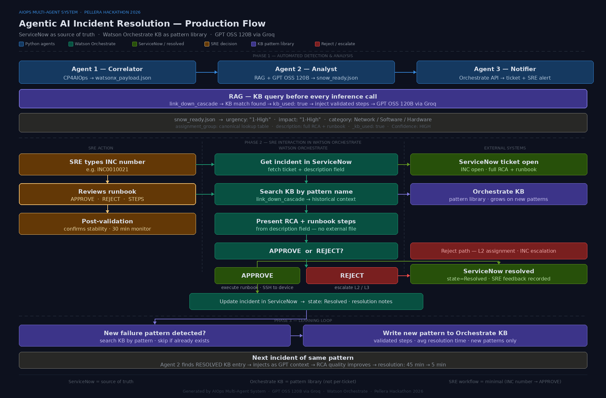

# Agentic AI-Powered Incident Resolution System

> **Pellera Hackathon 2026 — Powered by IBM**
>
> *45 minutes manual → 5 minutes automated. Every resolution makes the next smarter.*

[](https://python.org)
[](https://www.ibm.com/products/watson-orchestrate)
[](https://developer.servicenow.com)
[](https://developer.cisco.com/site/sandbox/)

---

## What This Does

An **Agentic AI-powered AIOps platform** that automates and governs the entire incident lifecycle — from detection and root cause analysis to remediation, validation, and continuous learning — while maintaining strict human-in-the-loop controls for enterprise trust and safety. 
This project transforms IT operations from reactive troubleshooting → intelligent, self-improving automation.
The platform integrates **IBM Cloud Pak for AIOps**, **GPT OSS 120B via Groq**, **Watson Orchestrate**, **ServiceNow**, **Microsoft Teams**, and **Cisco Catalyst 8000** into a cohesive, production-grade system capable of resolving complex multi-domain incidents across network, infrastructure, platform, and application layers.

### Key Characteristics

| # | Characteristic |
|---|---|
| 1 | Agentic architecture with specialized AI agents operating under clear responsibility boundaries |
| 2 | LLM-powered RCA and runbook generation, grounded in real operational data |
| 3 | Human-approved autonomous execution on live infrastructure |
| 4 | Closed-loop learning system that improves accuracy with every validated resolution |
| 5 | Enterprise ITSM and collaboration integration with full auditability |

### Business Outcomes

- **60–80% reduction in MTTR** for recurring incidents
- **Elimination of inconsistent manual triage**
- **Operational knowledge retained** despite team turnover
- **Safe autonomy** with full governance
- **Scalable** across domains, platforms, and teams

---

## Architecture Overview



```
Hackathon.txt
    │
    ▼
Agent 1 — Correlator
    reads CP4AIOps export → watsonx_payload.json
    │
    ▼
Agent 2 — Analyst (AIOps_RCA_Agent)
    LLM RCA via Watson Orchestrate → rca_output.json
    snow_ready.json · HTML report cards · KB pattern files
    │
    ▼
Agent 3 — Notifier (AIOps_Incident_Resolution_Manager)
    ServiceNow ticket (via Orchestrate) → Teams + Email → KB upload
    │
    ▼
SRE: opens Orchestrate → types INC number → reviews runbook → types APPROVE
    │
    ▼
Watson Orchestrate
    executes runbook steps on live Cisco Cat8k via SSH
    │
    ▼
Resolution recorded
    KB marked RESOLVED — next identical incident resolved faster
```

### Agent 1 — Correlator *(CP4AIOps Ingestion & Context Builder)*

- Consumes CP4AIOps incidents and alerts (real-time or export)
- Normalises incident and alert schema into a single canonical incident
- Infers topology relationships, device OS and interfaces, and golden signals (latency, availability, saturation, errors)
- Produces a structured incident payload for Agent 2

### Agent 2 — Analyst *(LLM-Driven RCA & Runbook Generator)*

- Retrieves validated `RESOLVED` knowledge base patterns via **RAG** before every inference call
- Calls GPT OSS 120B with 32 strict system rules to produce root cause analysis, correlation reasoning, impact assessment, and domain-specific executable runbooks
- Applies deterministic safeguards: command validation, assignment group resolution, CMDB integrity
- Generates machine-readable RCA output, ServiceNow-ready incident artifacts, HTML report cards, and `PENDING` KB entries

### Agent 3 — Notifier & Orchestrator *(Human Approval & Execution)*

- Creates ServiceNow P1 incidents with full RCA embedded in the description field
- Notifies SREs via Microsoft Teams adaptive card and email
- Presents RCA and runbook context for SRE review
- Waits for explicit human approval (`APPROVE` / `REJECT` / `STEPS`)
- Executes runbooks via controlled SSH only after approval
- Captures execution outcome and SRE feedback

### Continuous Learning Loop

```
Run 1 (cold):   LLM generates RCA from scratch
                KB file written as PENDING

SRE approves → runbook executes → steps validated
                KB file marked RESOLVED

Run 2 (warm):   Agent 2 finds RESOLVED KB entry
                Injects validated steps into LLM prompt
                RCA quality improves · resolution time drops
```

> Only human-validated resolutions are reused as LLM context. The system becomes faster, safer, and more accurate over time.

---

## Repository Structure

```
├── agent1_correlator.py              Agent 1 — CP4AIOps export parser
├── agent2_analyst.py                 Agent 2 — LLM RCA + runbook generator
├── agent3_notify.py                  Agent 3 — ticket creation + notifications
├── kb_utils.py                       Knowledge base read/write utilities
├── kb_sync.py                        KB resolution sync (polls ServiceNow)
├── runbook_tool.py                   Watson Orchestrate ADK tool — SSH execute
├── requirements_runbook_tool.txt     Dependencies for runbook_tool
├── run_demo.py                       One-command demo runner
│
├── config/
│   ├── assignment_groups.yaml        SNOW group mapping
│   ├── snow_category_map.yaml        SNOW category mapping
│   └── device_os_map.yaml            Device model → OS class mapping
│
├── docs/
│   ├── architecture.png              Production agent flow diagram
│   ├── component_flow.png            Architecture component flow
│   ├── Orchestrate_Incident_Resolution_Manager_behavior.txt  AIOps_Incident_Resolution_Manager Agent behavior instructions
│   └── Orchestrate_rca_agent_behavior.txt    AIOps_RCA_Agent behavior instructions
│   └── production_roadmap.md.txt     Product roadmap
│
├── Hackathon.txt                     CP4AIOps export — demo input for Agent 1
├── .env.example                      Environment variable template
├── requirements.txt                  Python dependencies
├── .gitignore
└── README.md
```
---
## Built on IBM's Enterprise AI Platform
| Layer | Technology |
|---|---|
| Alert correlation | IBM Cloud Pak for AIOps |
| Agent orchestration | IBM Watson Orchestrate |
| AI inference | GPT OSS 120B via Groq |
| Knowledge base (RAG) | Watson Orchestrate KB |
| ITSM | ServiceNow |
| Live runbook execution | Cisco Catalyst 8000 (DevNet Always-On Sandbox) |
| SRE notifications | Microsoft Teams + Gmail SMTP |
| Runtime | Python 3.11+ |

---

## Prerequisites

- Python 3.11+
- IBM Watson Orchestrate instance with:
  - `AIOps_RCA_Agent` deployed (LLM inference)
  - `AIOps_Incident_Resolution_Manager` deployed (ticket creation + runbook execution)
  - `aiops-incident-patterns-kb` knowledge base created
  - `runbook_tool.py` registered as ADK Python tools
  - `cat8k_creds` is registered as a connection for accessing the Cisco Catalyst 8000
  - `servicenow_ibm_184bdbd3` is registered as a connection for accessing the ServiceNow instance.
- ServiceNow developer instance ([get one free](https://developer.servicenow.com))
- IBM watsonx.ai project *(optional — only for `--inference-route watsonx`)*
- Gmail App Password or other SMTP credentials
- Microsoft Teams Incoming Webhook URL
- Cisco DevNet Catalyst 8000 Always-On Sandbox

### Inference Routes

| Flag | Route | Model | Use case |
|---|---|---|---|
| `--inference-route orchestrate` | Watson Orchestrate | GPT OSS 120B | Demo (recommended) |
| `--inference-route watsonx` | IBM watsonx.ai | ibm/granite-3-8b-instruct | Fully IBM stack |

---

## Quick Start

### 1. Clone and install

```bash
git clone https://github.com/venkataallam/Agentic-AI-Powered-Incident-Resolution-System.git
cd Agentic-AI-Powered-Incident-Resolution-System
pip install -r requirements.txt
```

### 2. Configure environment

```bash
cp .env.example .env
# Edit .env with your API keys, SNOW URL, SMTP credentials, etc.
```

To customise ServiceNow mappings for your environment, edit the YAML files in `config/` — no code changes required:

```bash
config/assignment_groups.yaml   # Maps alert layer → SNOW group name
config/snow_category_map.yaml   # Maps model category → SNOW OOTB category
config/device_os_map.yaml       # Maps device model string → OS class
```

### 3. Install and activate Watson Orchestrate ADK

```bash
pip install ibm-watsonx-orchestrate
pip install paramiko python-dotenv
orchestrate env activate -e .env
orchestrate agents list   # should show AIOps_RCA_Agent and AIOps_Incident_Resolution_Manager
```

---

## Watson Orchestrate Setup

### Step 1.a — ServiceNow connection

```
Watson Orchestrate UI → Manage → Connections
Search: servicenow_ibm_184bdbd3
Authentication Type: OAuth2Password
Provide: Server URL, Token URL, ClientID, ClientSecret, GrantType=password
```
### Step 1.b — Cisco Catalyst 8000 connection

```
orchestrate env activate Orchestrator environment name
orchestrate connections set-credentials -a cat8k_creds --env draft -e "SANDBOX_HOST=devnetsandboxiosxec8k.cisco.com" -e "SANDBOX_PORT=22" -e "SANDBOX_USER=username" -e "SANDBOX_PASS=password"
orchestrate connections set-credentials -a cat8k_creds --env live -e "SANDBOX_HOST=devnetsandboxiosxec8k.cisco.com" -e "SANDBOX_PORT=22" -e "SANDBOX_USER=username" -e "SANDBOX_PASS=password"
```

### Step 2 — Create AIOps_RCA_Agent

```
Watson Orchestrate UI → Build → Create Agent → Create from scratch
Name: AIOps_RCA_Agent
Behavior: paste contents of docs/Orchestrate_rca_agent_behavior.txt
Deploy
```

### Step 3 — Create AIOps_Incident_Resolution_Manager

```
Watson Orchestrate UI → Discover → Ticket Manager → Use template
Name: AIOps_Incident_Resolution_Manager
Behavior: paste contents of docs/Orchestrate_Incident_Resolution_Manager_behavior.txt
  ⚠ DO NOT delete existing ServiceNow rules — APPEND the AIOps instructions below them
Deploy
```

### Step 4 — Import the runbook executor tool

```bash
orchestrate tools import \
  -k python \
  -f runbook_tool.py \
  -r requirements_runbook_tool.txt

orchestrate tools list   # confirm execute_step appears
```

### Step 5 — Add execute_step tool to AIOps_Incident_Resolution_Manager agent

```
Watson Orchestrate UI → Agents → AIOps_Incident_Resolution_Manager
→ Tools tab → Add tool → execute_step → Save
```

### Step 6 — Upload KB articles to both agents

After the first run of `agent2_analyst.py`, upload the generated files from `kb_documents/`:

```
Watson Orchestrate UI → Agents → [each agent]
→ Knowledge tab → Add source → Upload file
→ Upload: kb_link_down_cascade.txt, kb_auth_failure_cascade.txt, kb_latency_cascade.txt
→ Confirm "Chat with documents" toggle is ON → Save
```

---

## Running the Demo

### Prepare the Cisco DevNet Sandbox

```bash
# 1. Launch the Catalyst 8000 Always-On sandbox
# 2. Copy the new password from the I/O tab
# 3. Update SANDBOX_PASS in .env

# 4. Update sandbox credentials in Orchestrate
orchestrate connections set-credentials -a cat8k_creds --env draft \
  -e "SANDBOX_HOST=devnetsandboxiosxec8k.cisco.com" \
  -e "SANDBOX_PORT=22" \
  -e "SANDBOX_USER=your-username" \
  -e "SANDBOX_PASS=your-password"

orchestrate connections set-credentials -a cat8k_creds --env live \
  -e "SANDBOX_HOST=devnetsandboxiosxec8k.cisco.com" \
  -e "SANDBOX_PORT=22" \
  -e "SANDBOX_USER=your-username" \
  -e "SANDBOX_PASS=your-password"
```

### Create the fault (simulates the P1 incident)

```bash
ssh your-username@devnetsandboxiosxec8k.cisco.com

Cat8kv_AO_Sandbox# conf t
Cat8kv_AO_Sandbox(config)# interface GigabitEthernet3
Cat8kv_AO_Sandbox(config-if)# shutdown
Cat8kv_AO_Sandbox(config-if)# end
Cat8kv_AO_Sandbox# show interface GigabitEthernet3
# Expected: GigabitEthernet3 is down, line protocol is down
```

### Demo Step 1 — Run the pipeline (Terminal 1)

```bash
python run_demo.py
```

Expected output to highlight:

```
Agent 2 complete
  KB context used      : 0 incident(s)   ← first run, cold start

TICKET CREATION SUMMARY
  incident-network-001  INC0010xxx  ✅ created
  incident-auth-001     INC0010xxx  ✅ created
  incident-payment-001  INC0010xxx  ✅ created

KB Document Upload Summary:
  ✓ kb_link_down_cascade.txt    uploaded   PENDING
```

### Demo Step 2 — Teams notification

Open Microsoft Teams → find the AIOps notification channel.

- Click **View RCA Report** → IBM-styled HTML report card with full root cause analysis
- Click **View Ticket** → ServiceNow P1 ticket with full RCA analysis & runbook in the description field
- Click **Open Watson Orchestrate** → launches `AIOps_Incident_Resolution_Manager` chat

### Demo Step 3 — SRE approval flow in Watson Orchestrate

```
SRE:   INC0010045
Agent: Fetches ticket → extracts pattern: link_down_cascade
       Searches KB → finds kb_link_down_cascade.txt
       Presents: root cause, 4 runbook steps, KB history
       Prompts: Type APPROVE / STEPS / REJECT

SRE:   APPROVE
Agent: execute_step 1 → SSH → show interfaces GigabitEthernet3 → down confirmed
       execute_step 2 → no shutdown → line protocol is up
       execute_step 3 → show ip interface brief → GigabitEthernet3 confirmed
       execute_step 4 → show ip bgp summary → Established
       "All 4 steps complete. Is CORE-RTR-01 operating normally?"

SRE:   YES
Agent: Updates INC0010045 → state: Resolved
       "INC0010045 resolved. Resolution complete."
SRE: Update the Incident work notes as Runbook Worked

If SRE decided to REJECT after reviewing the Runbook steps
SRE: REJECT
Agent: INC0010045 Escalated to L2 team
SRE: Update the Incident work notes as Escalated
```

### Demo Step 4 — KB sync (Terminal 2)

```bash
python kb_sync.py --interval 30
```

Expected output:

```
[KB-SYNC] 'Runbook Worked' found ✓ — marking KB
[KB-SYNC] kb_link_down_cascade.txt marked STATUS: RESOLVED ✓
```

### Demo Step 5 — The warm run (Terminal 1:Second Run)

```bash
python run_demo.py --skip-agent1
```

Key output to highlight:

```
[KB-RAG] ✓ 1 RESOLVED match(es) for 'link_down_cascade' — injecting into LLM prompt
[1/3] incident-network-001 ... KB match found — enriching prompt

Agent 2 complete
  KB context used      : 3 incident(s)   ← THIS IS THE LEARNING LOOP
```

> **"Run 1: 0 KB context, 9 seconds per incident. Run 2: 3 KB context, 3 seconds per incident. Same input. Better output. The system learned."**

---

## Troubleshooting

| Symptom | Cause | Fix |
|---|---|---|
| `execute_step returns SSH auth failed` | Sandbox relaunched — password changed | DevNet → I/O tab → copy new password → update `SANDBOX_PASS` in `.env` and re-import tool |
| `Agent says tool execute_step not found` | Tool not registered or not added to agent | `orchestrate tools list` — if missing, reimport; if present, add via Tools tab |
| `KB articles not being found` | Indexing delay after upload | Wait 2–3 minutes after upload · confirm "Chat with documents" toggle is ON |
| `GigabitEthernet3 comes back up on its own` | Shared sandbox — another user ran `no shutdown` | Run `shutdown` again in `conf t` and verify with `show ip interface brief` |
| `orchestrate env activate fails` | Env vars not set correctly | Confirm `ORCHESTRATE_INSTANCE_URL` and `ORCHESTRATE_API_KEY` are in `.env` |
| `Agent not presenting runbook steps` | Description field format mismatch | Re-run `agent2_analyst.py` then `agent3_notify.py` and use new INC numbers |

---


## Architecture Diagrams

See `docs/` for:
- `architecture.png` — Architecture diagram
- `component_flow.png` — Architecture component flow diagram

See `docs/production_roadmap.md` for the full production evolution plan including CMDB integration, multi-tenant support, multi-OS runbook templates, and automated KB resolved marking.

---
*Pellera Hackathon 2026 · Powered by IBM*
